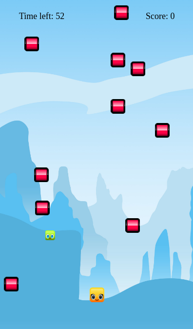

# First Project - Don't leave the kids alone
This is a game project based on HTML5 and Javascript. It is part of my Ironhack Web Development Bootcamp.

## Installation
You will need juts to access https://tiny.cc/alisonbessa and **start having fun!**

## How to play
You must use the directional keys to control the mais char.  
Try to avoid the pink enemies that will fall randomly.  
Catch as many green kids as possible.  
**Atention:** It might look easy in the begining, but all the speeds will be increased as you score!

 
 
 
 ## Contact
 In case you want to contact me, send and e-mail to alisonbessa@gmail.com

### Special thanks for my TAs: Heitor & Monica

#### Images sources
Background: https://escoban.artstation.com/projects/J8ron
Sprites: https://opengameart.org/content/blocks-set-01
